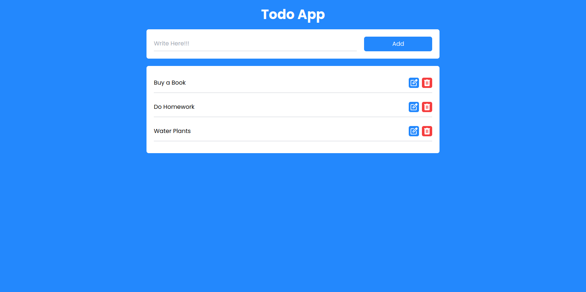

# todo-app

Simple todo app to record daily activities so we don't forget

## Table of contents

- [Overview](#overview)
  - [Feature](#feature)
  - [Screenshot](#screenshot)
  - [Deploy](#deploy)
- [My process](#my-process)
  - [Built with](#built-with)
- [Author](#author)

## Overview

### Feature

Users should be able to:

- [x] Add Todo
- [x] Delete Todo
- [x] Update Todo

## Screenshot

## Deploy

- [vercel](https://todo-app-denny.vercel.app/)

## My process

### Built with

- React vite
- Typescript
- Tailwind
- Framer motion

## Author

- Website - [dennyshuda](https://github.com/dennyshuda)
